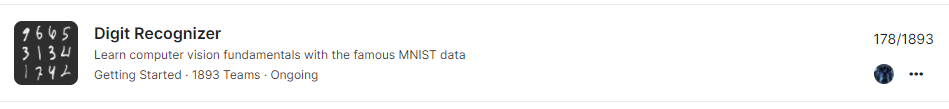

# Digit-Recognizer

 
 

<table align="center">
  <tr>
    <th>Model</th>
    <th>Submission Accuracy </th>
  </tr>
    <tr>
	  <td> Simple ANN</td>
	  <td>97.578%</td>
  </tr>
  <tr>
	  <td>Simple CNN</td>
	  <td>98.525% </td>
  </tr>
    <tr>
	  <td>CNN with Data Augmentation</td>
	  <td>99.514%</td>
  </tr>
</table>
